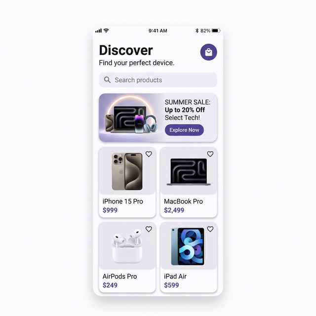
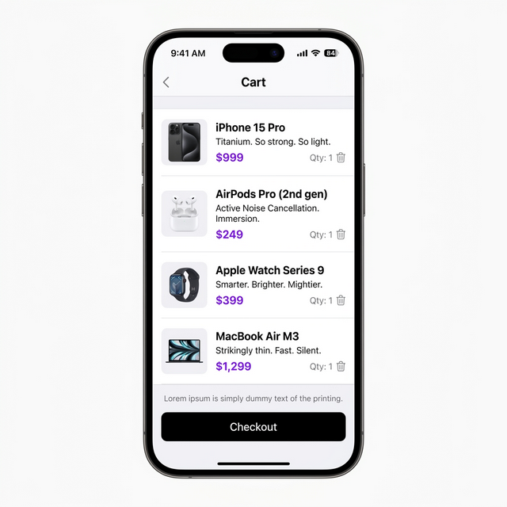

# 🛍️ Mini Katalog Uygulaması

Modern ve temiz bir arayüze sahip Flutter ürün kataloğu uygulaması. Ürünler **wantapi.com** API'sinden çekilir, ürün detayları görüntülenir ve sepete ekleme simülasyonu yapılabilir.

## ✨ Özellikler

- 📦 API'den gerçek zamanlı ürün verisi çekme
- 🖼️ Banner görseli ile modern ana sayfa
- 🔍 Ürün arama ve filtreleme
- 📱 GridView ile ürün kartları düzeni
- 📄 Ürün detay sayfası (görsel, fiyat, açıklama, teknik özellikler)
- 🛒 Sepete ekleme simülasyonu (SnackBar bildirimi)
- 🎨 Material 3 tasarım sistemi
- 🔄 Hero animasyonu ile sayfa geçişleri

## 🛠️ Teknolojiler

- **Flutter** 3.x
- **Dart** 3.x
- Harici paket kullanılmamıştır (sadece Flutter Material kütüphanesi ve Dart standart kütüphaneleri)

## 📂 Proje Yapısı

```
lib/
├── main.dart                     # Uygulama giriş noktası ve tema ayarları
├── models/
│   └── product.dart              # Product veri modeli (fromJson)
├── pages/
│   ├── home_page.dart            # Ana sayfa (banner, arama, ürün listesi)
│   └── product_detail_page.dart  # Ürün detay sayfası
└── widgets/
    └── product_card.dart         # Tekrar kullanılabilir ürün kartı
```

## 🚀 Kurulum ve Çalıştırma

1. Flutter'ın kurulu olduğundan emin olun:
   ```bash
   flutter doctor
   ```

2. Projeyi klonlayın:
   ```bash
   git clone <repository-url>
   cd mini_katalog_uygulaması
   ```

3. Bağımlılıkları yükleyin:
   ```bash
   flutter pub get
   ```

4. Uygulamayı çalıştırın:
   ```bash
   flutter run
   ```

## 📱 Ekran Görüntüleri

| Ana Sayfa | Ürün Detay | Sepet |
|-----------|------------|-------|
|  |  |  |

## 📝 Kullanılan API

Ürün verileri [WantAPI](https://wantapi.com/products.php) API'sinden çekilmektedir. Bu API eğitim ve demo amaçlıdır.

Banner görseli: `https://wantapi.com/assets/banner.png`

## 📌 Öğrenme Hedefleri

Bu proje aşağıdaki Flutter kavramlarını kapsamaktadır:

- StatelessWidget ve StatefulWidget kullanımı
- Navigator.push / Navigator.pop ile sayfa geçişleri
- MaterialPageRoute ile route yönetimi
- Sayfalar arası veri taşıma (Route Arguments)
- JSON veri modelleme (fromJson)
- GridView.builder ile dinamik listeleme
- Image.network ile görsel yükleme
- TextField ile arama/filtreleme
- SnackBar ile kullanıcı bildirimi
- Material 3 tema özelleştirmesi

## 📄 Lisans

Bu proje eğitim amaçlı geliştirilmiştir.
